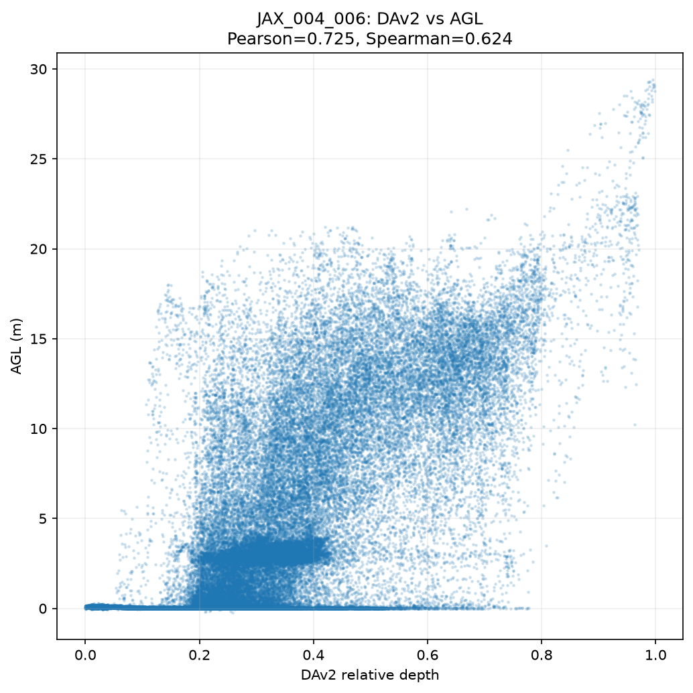

# JAX_004_006 — DAv2 vs AGL check

Source: `data/dfc2019/experiments/dav2_baseline/metrics.csv`, confirmed by re-running
`scripts/diagnose_dfc_tile.py JAX_004_006` (row was already present in metrics.csv,
contrary to the assumption that it hadn't been diagnosed yet).

## Numbers (all-finite pixels, n = 1,048,576)

- Pearson: **0.7252**
- Spearman: **0.6238**

For reference, the two tiles already diagnosed:
- JAX_022_009: Pearson 0.167 / Spearman 0.151
- JAX_004_014: Pearson 0.814 / Spearman 0.728

JAX_004_006 sits between them, closer to JAX_004_014.

## Scatter shape

**In between the two reference cases**: there's a real monotonic upper envelope (AGL
ceiling rises steadily as DAv2 value increases from ~0 to ~1.0, cleanest above
DAv2≈0.8), but it's wrapped in a wide, noisy cloud below that envelope — most visibly
a dense near-zero-AGL band spanning the full DAv2 range and a horizontal band around
AGL≈3m across DAv2≈0.2–0.4 — so it reads as "right order at the top, but a lot of
scale/ordering noise in the bulk of the pixels," not a clean tight curve.
